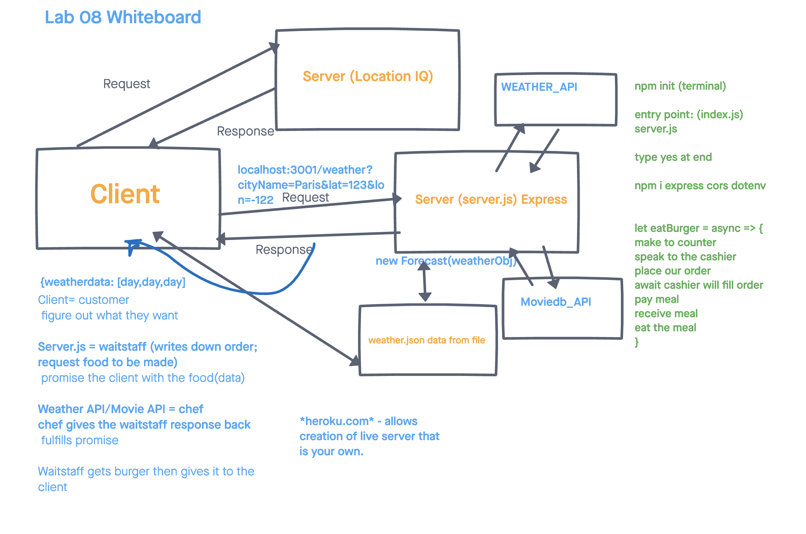

# City Explorer Api

**Author**: Brandon Mizutani
**Version**: 1.0.0 Trello: [City Explorer](https://trello.com/b/ENQ558B6/city-explorer-api) | Netlify: [City Explorer](https://mizutani-city-explorer.netlify.app/))

## Overview

This application, City Explorer, utilizes the Axios library to render user's request for location data (such as the longitude and latitude and a map) from LocationIQ (third-party API)

## Getting Started

Step 1: **WhiteBoard**- 

Step 2: **WhiteBoard** - 

## Architecture

-Express
-Cors
-.env
- Bootstrap
- JavaScript

## Change Log

Name of feature: lab-07-express

Estimate of time needed to complete: 4 hours

Start time: 1:20

Finish time: 5:00

Actual time needed to complete: 4 hr 20 min

## Credit and Collaborations

Jae Loney
JP Jones

## Retrospective Lab 07

1. What went well, that I might forget if I don’t write down?
  This lab was by far the most challenging so far in 301! I think using trello really helped the most in this lab.

2. What did I learn today?
  I learned a tremendous amount about express servers and how to connect your react app to a local api.

3. What should I do differently next time?
  For some reason, I was getting frustrated because I thought that my code was not working, but I had to restart my app and the nodemon. Once I did that the app ran smoothly!

4. What still puzzles me, or what do I need to learn more about?
  I think I will pay more attention to express servers, particularly creating a function to render it onto your app.

5. Is the assignment complete? If not, where exactly did you leave off, and what work remains?
  The assignment is complete! Perhaps tomorrow or monday I can stylizes the page to create a more attractive looking rendered, weather data.
  