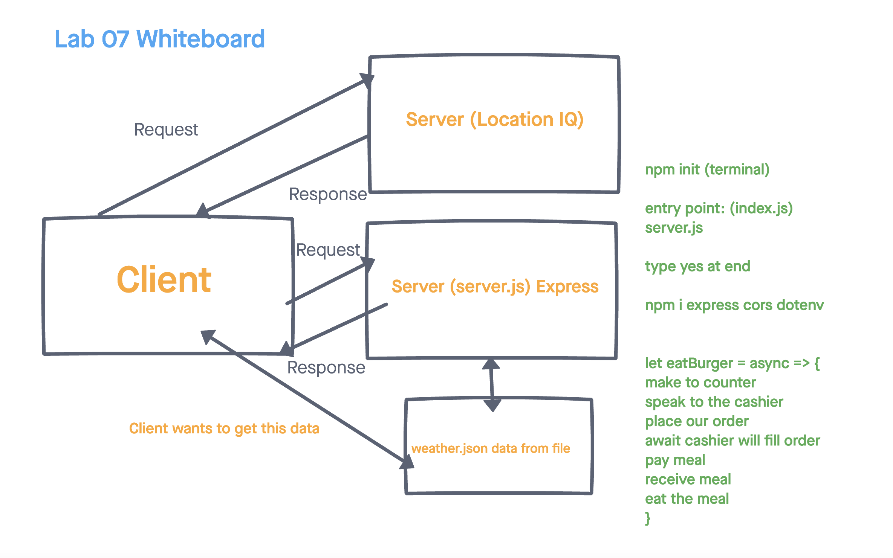

# City Explorer Api

**Author**: Brandon Mizutani
**Version**: 1.0.0 (increment the patch/fix version number if you make more commits past your first submission)

## Overview

This application, City Explorer, utilizes the Axios library to render user's request for location data (such as the longitude and latitude and a map) from LocationIQ (third-party API)

## Getting Started

Step 1: **WhiteBoard**- 

## Architecture

-Express
-Cors
-.env

## Change Log

Name of feature: ________________________________

Estimate of time needed to complete: _____

Start time: _____

Finish time: _____

Actual time needed to complete: _____

## Credit and Collaborations

Jae Loney
JP Jones
