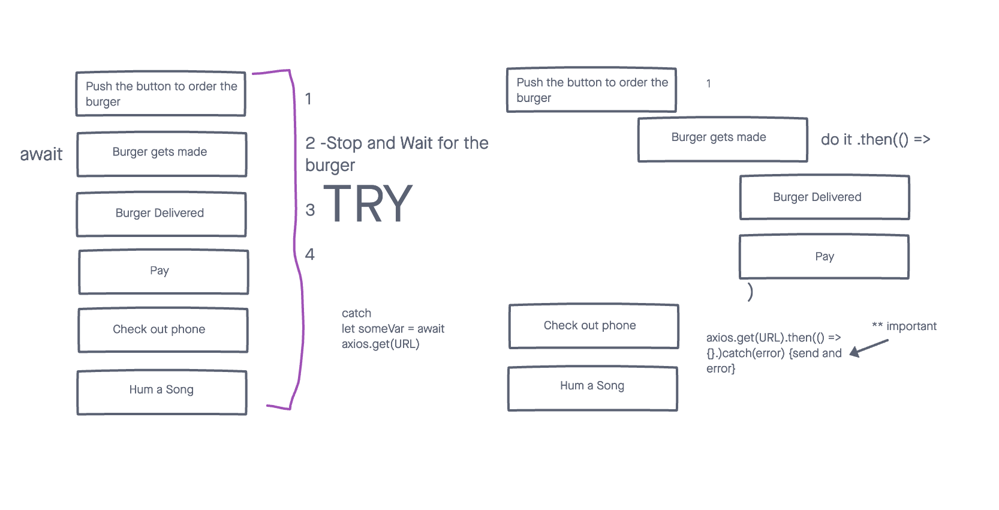
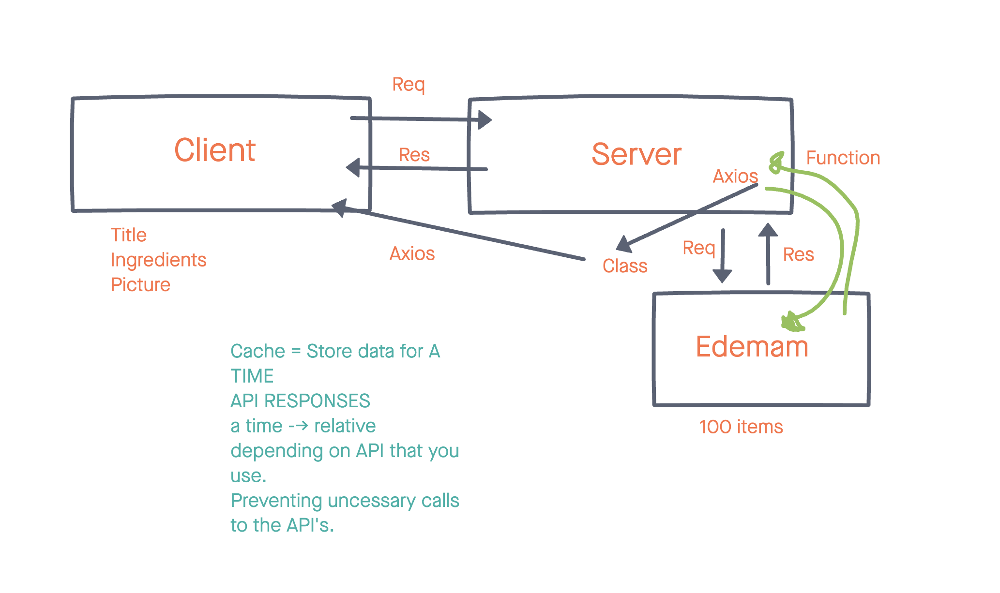

# City Explorer Api

**Author**: Brandon Mizutani
**Version**: 1.0.0 Trello: [City Explorer](https://trello.com/b/ENQ558B6/city-explorer-api) | Netlify: [City Explorer](https://mizutani-city-explorer.netlify.app/))

## Overview

This application, City Explorer, utilizes the Axios library to render user's request for location data (such as the longitude and latitude and a map) from LocationIQ (third-party API)

## Getting Started

Step 1: **WhiteBoard**- 

Step 2: **WhiteBoard** - 

Step 3: **WhiteBoard** - 

Step 4: **WhiteBoard** - 

## Architecture

-Express
-Cors
-.env
- Bootstrap
- JavaScript

## Change Log

**Lab 07**
Name of feature: lab-07-express

Estimate of time needed to complete: 4 hours

Start time: 1:20

Finish time: 5:00

Actual time needed to complete: 4 hr 20 min

Change Log: 10/09/21 API for Weather Forecast

**Lab 08**
Name of feature: lab-08

Estimate of time needed to complete: 6 hours

Start time: 5:15pm

Finish time: 8:45

Actual time needed to complete: 3 1/2 hours

Change Log: 10/13/21 Movie and Weather API with heroku

**Lab 09**
Name of feature: lab-09-modules

Estimate of time needed to complete: 2 hours

Start time: 12:30

Finish time: 2:00

Actual time needed to complete: 1 1/2 hours

**Lab 10**
Name of feature: lab-10-cache

Estimate of time needed to complete: 2 hours

Start time: 5:10

Finish time: 7:42

Actual time needed to complete: 2 and 1/2 hours

## Credit and Collaborations

Jae Loney
JP Jones

## Retrospective Lab 07

1. What went well, that I might forget if I don’t write down?
  This lab was by far the most challenging so far in 301! I think using trello really helped the most in this lab.

2. What did I learn today?
  I learned a tremendous amount about express servers and how to connect your react app to a local api.

3. What should I do differently next time?
  For some reason, I was getting frustrated because I thought that my code was not working, but I had to restart my app and the nodemon. Once I did that the app ran smoothly!

4. What still puzzles me, or what do I need to learn more about?
  I think I will pay more attention to express servers, particularly creating a function to render it onto your app.

5. Is the assignment complete? If not, where exactly did you leave off, and what work remains?
  The assignment is complete! Perhaps tomorrow or monday I can stylizes the page to create a more attractive looking rendered, weather data.

## Retrospective Lab - 08

1. What went well, that I might forget if I don’t write down?
  The one thing I would say that went well was the backend surprisingly!  

2. What did I learn today?
  Heroku (via code review on thursday)

3. What should I do differently next time?
  Ask for help for heroku (I had an incredibly difficult time figuring out why the heroku app was not working, and the weather and movie data was not rendering on my netlify)

4. What still puzzles me, or what do I need to learn more about?
  I still believe I have issues with heroku, but I think I will ask in the future if I have any more issues

Thinking about each of your assignments for the day, reflect on:

1. Is the assignment complete? If not, where exactly did you leave off, and what work remains?
  Yes! the app works, just the heroku server is still a little confusing to me.

## Retrospective Lab 09

1. What went well, that I might forget if I don’t write down?
  This lab was fairly simple in that we had to componentize the back end using the modules formula.

2. What did I learn today?
  Modules and how it makes the backend server.js more organized and clean.

3. What should I do differently next time?
  Nothing! Like I had mentioned, it was a fairly simple lab today, as I was all caught up with the past labs.

4. What still puzzles me, or what do I need to learn more about?
  Still a little confused as to why in class today we created functions that did not require async.

Thinking about each of your assignments for the day, reflect on:

1. Is the assignment complete? If not, where exactly did you leave off, and what work remains?
  The assignment is complete!

## Retrospective Lab 10

1. What went well, that I might forget if I don’t write down?
  I would say the creating the boiler point cache file was very easy in this lab.

2. What did I learn today?
  Cache and storing data for a period of time.

3. What should I do differently next time?
  I think I should definitely check all of my variable names, as that was a point of contention (it was the reason why my code was breaking).

4. What still puzzles me, or what do I need to learn more about?
  Still a little puzzled by cache and what it actually does.

Thinking about each of your assignments for the day, reflect on:

1. Is the assignment complete? If not, where exactly did you leave off, and what work remains?
  I believe that the assignment is complete. During next class, I hope to see what exactly a complete cache looks like.
